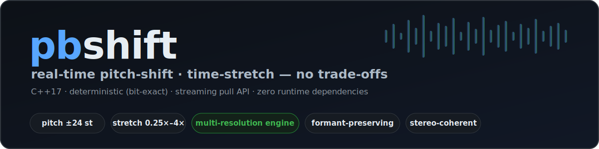
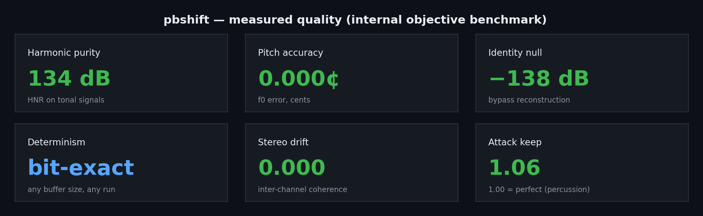
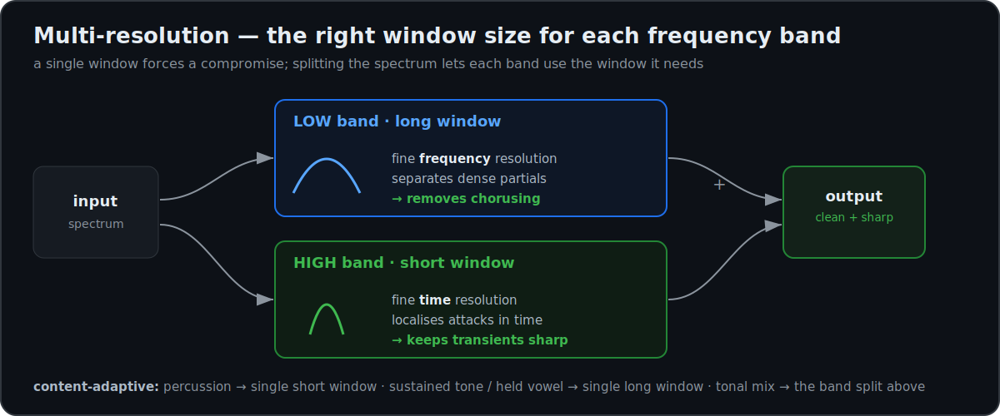
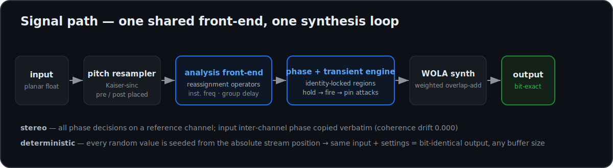

# pbPitchShift (`pbshift`)



**[日本語 README はこちら / Japanese README → README.ja.md](README.ja.md)**

A real-time **pitch-shifting / time-stretching C++ library**, engineered so that harmonic purity, transient sharpness, natural formants, and bit-exact reproducibility all hold at once — none traded off against the others.

- **C++17 static library**, zero external runtime dependencies (one bundled BSD-like FFT)
- **Streaming pull API** (`feed` → `available` → `read`, `finish` to flush) for real-time inserts and offline rendering alike
- **Pitch ±24 semitones**, **time-stretch 0.25×–4×** (wider values are accepted and clamped internally), independent and combinable
- **Formant preservation** via a True Envelope class spectral-envelope engine
- **Multi-resolution time-stretch engine** (offline) — band-dependent window sizing with content-adaptive layout, which removes the phase-vocoder "chorusing"/watery artifact on dense mixes, pads, and held vowels while keeping transients sharp
- **Deterministic**: same input + same settings ⇒ **bit-identical output**, regardless of host buffer size, and across re-renders

> Status: under active development (pre-1.0). The streaming API shown below is the stable surface.

---

## Table of contents

1. [Why pbshift](#why-pbshift)
2. [Measured results](#measured-results)
3. [Feature details](#feature-details)
4. [Algorithm overview](#algorithm-overview)
5. [Public API](#public-api)
6. [CLI usage](#cli-usage)
7. [Building](#building)
8. [Tests and quality gates](#tests-and-quality-gates)
9. [Benchmark methodology](#benchmark-methodology)
10. [Determinism guarantee](#determinism-guarantee)
11. [Latency](#latency)
12. [Repository layout](#repository-layout)
13. [Roadmap](#roadmap)
14. [License and credits](#license-and-credits)

---

## Why pbshift

Time-scale modification classically forces a trade-off: harmonic purity **or** sharp transients **or** natural formants **or** reproducible renders. pbshift is engineered so that none of these degrade the others:

- A single shared analysis front-end feeds every sub-engine — there are no parallel processing chains that can drift apart in gain or phase.
- Transients are handled as sparse, time-domain events rather than being smeared through the spectral pipeline.
- All stochastic components are **position-seeded**, so randomness never breaks reproducibility.
- The bypass path (stretch 1.0, pitch 0) is held to a strict null-test gate from the first commit — the engine cannot silently color the signal.

## Measured results

pbshift's own objective measurements on a deterministic synthetic/TTS corpus (see [Benchmark methodology](#benchmark-methodology)). All numbers are reproducible with the scripts in `benchmarks/`.



| Metric (median unless noted) | pbshift |
|---|---:|
| Harmonic purity (HNR, tonal signals) | **134 dB** |
| Pitch accuracy (f0 error) | **0.000 cents** |
| Stereo coherence drift | **0.000** |
| Attack preservation ratio, percussion (1.00 = perfect) | **1.06** |
| Formant envelope distance, voice, mean over ±pitch conditions | **2.73 dB** |
| Bypass / identity reconstruction null | **−138 dB** |

Notes:

- HNR (harmonic-to-interharmonic-noise ratio) measures "phasiness"/metallic noise on tonal material; higher is cleaner.
- Attack preservation ratio compares 10–90 % rise times of matched onsets in output vs. input; values above 1.0 indicate smearing, so 1.06 is near-perfect attack retention.
- Formant envelope distance is the log-spectral distance between input and output spectral envelopes on time-mapped frames.
- These are internal measurements on the corpus and conditions described below, not listening tests. The harness is engine-agnostic — point it at any engine that exposes the CLI convention and score it for yourself.

## Feature details

### Pitch shifting

- Range: **−24 to +24 semitones** (continuous, fractional values allowed).
- Implemented with an engine-internal Kaiser-windowed sinc resampler combined with the spectral stretch engine.
- **Direction-adaptive resampler placement**: for downward shifts the resampler runs **before** the engine (slowing articulation into the analysis), for upward shifts it runs **after** the engine (avoiding temporal compression of articulation). This placement is chosen automatically per shift direction and measurably improves consonant/attack naturalness.

### Time stretching

- Range: **0.25× to 4×** (ratio = output duration / input duration). Wider values are accepted and clamped by the engine.
- Pitch and stretch are fully independent and can be combined (e.g. +7 st at 1.5×).
- At deep compression the analysis hop is automatically shortened so magnitude evolution is never temporally aliased (no content skipped between frames).

### Multi mode (general-purpose, transient-adaptive)

`Music` / `Rhythm` mode (CLI `--multi`) is a streaming general-purpose path tuned for drums, mixes, and other broadband/percussive material. It reconstructs sharp, single (non-doubled) transients *and* a chorus-free sustain from one mechanism set, with no rate-pinning or onset phase-reset scheduling tricks (which are what leave a flam/echo on stretched drums):

- **Long analysis window, permanent short synthesis window.** The long window keeps frequency resolution; the short synthesis window (dual-window WOLA, Portnoff 1976; Allen & Rabiner 1977) discards the iFFT skirts that would spread a phase-modified transient into pre/post echo. The dual `sig`/`norm` reconstruction stays exact through any window pair.
- **Spectrum-wide identity-phase-locked coherence on every frame** (Laroche & Dolson 1999), driven by the reassignment **group delay** from the analysis front-end: each valley-to-valley partial region is rebuilt as a rigid body about its peak's time-propagated phase, so overlapping grains reinforce into a single impulse instead of combing.
- **Energy-rising partial suppression** (cf. transient processing, Röbel 2003): a broadband hit spikes many bins; partials whose energy jumps sharply over the previous frame are merged onto the few strongest coherent centres, so the whole click is governed by a handful of phase centres = one crisp attack rather than a fan of detuned copies.
- **Unbroken phase continuity** — no onset reset — so all overlapping grains place a transient at one instant. Stereo uses the same verbatim inter-channel phase copy as the default path, so the image is preserved.

Opt-in (`--multi` / `Config::Mode::Music` / `Rhythm`); `Auto` and `Voice` are byte-for-byte unchanged.

### Multi-resolution time-stretching (offline)



The hardest time-stretch material — dense mixes, sustained pads, held vocal vowels — exposes the fundamental limit of a single analysis window. A **short** window keeps transients crisp but lacks the frequency resolution to separate closely-spaced partials, so their phases beat against the overlap-add grid and produce the classic phase-vocoder **"chorusing" / watery** artifact. A **long** window separates the partials cleanly but smears attacks. The optional multi-resolution engine resolves this the way high-end stretchers do — by processing different frequency bands with a window sized for each:

- **Low band, long window** — high frequency resolution keeps dense partials cleanly separated, which is what removes the chorusing/flutter on sustained and complex material.
- **High band, short window** — high time resolution keeps attacks sharp.
- Bands are split in the **STFT magnitude domain at the same frame timing**, so they stay phase-aligned across the boundary (no time-domain crossover "flam").

On top of the band split:

- **Content-adaptive layout.** The engine inspects the signal (spectral flatness + pitch periodicity) and picks the layout automatically:
  - broadband **percussion** → a single short window, no crossover (so isolated clicks stay razor-sharp — a band split would spread a click's low-frequency energy across the long window and dull the attack);
  - a pure **sustained tone or held vowel** → a single long window (every harmonic stays phase-coherent; splitting dense voice harmonics across a crossover would decorrelate them);
  - **everything else** (tonal mixes, polyphony, speech) → the multi-resolution split.
- **Ratio-adaptive windows and overlap.** Window length and synthesis overlap adapt to the stretch ratio — a longer window under expansion (tracks slowly-evolving harmonics), higher overlap under compression (keeps the analysis hop fine) — to hold quality across the whole 0.25×–4× range.
- **Transient pinning.** A *broadband*-onset detector pins the local rate to 1.0 across each attack so it is never time-spread, repaying the timing debt over the following ~100 ms. Gating on a broadband rise (not any spectral flux) keeps it from firing on tonal vibrato, which would otherwise inject amplitude modulation.
- **Stereo phase lock.** A reference channel drives all phase/onset decisions; the inter-channel phase difference is copied verbatim, preserving the stereo image. Deterministic and bit-identical, like the streaming path.

On pbshift's internal objective chorusing metric (1–25 Hz amplitude-modulation depth on sustained partials, plus attack-sharpness crest on transients), the multi-resolution engine drives the chorusing measure down across the large majority of signal-class × ratio combinations, with the largest reductions at moderate-to-extreme stretch (2×–4×) — exactly where the chorusing artifact is most audible — and holds sustained tonal, voice, and pure-tone material near the noise floor at every ratio. Reproduce with `benchmarks/ratio_eval.py`.

**Status: opt-in offline path.** The streaming default is unchanged; the multi-resolution engine is a whole-signal (buffered) path, selected via the `Offline` tier (see [CLI usage](#cli-usage)). It is gated behind an explicit switch pending listening-test confirmation, following the project's convention of validating perceptual changes by ear before promoting them to the default. Formant-preserving requests transparently fall back to the streaming engine.

### Formant preservation

- Optional (`setFormantPreserve(true)`), designed for pitch-shifted voice and other formant-critical material.
- Uses a **True Envelope class** cepstral spectral-envelope estimator (max-filter subsampling with adaptive iterative refinement) and applies the correction as a spectral pre-warp with per-bin gain clamping.
- Envelope order is tuned per FFT size; a mode gate automatically suppresses transient pinning in consonant-like contexts, which measurably improved voice quality.

### Processing modes and tiers

`Config` exposes a mode hint (`Auto` / `Voice` / `Rhythm` / `Music`) and a latency tier (`Live` / `StudioRT` / `Offline`). `StudioRT` is the current reference tier. `Music` / `Rhythm` activate the streaming **multi mode** (a general-purpose transient-adaptive path, see [below](#multi-mode-general-purpose-transient-adaptive)); the low-latency `Live` tier is an active roadmap item (see [Roadmap](#roadmap)). `Auto` and `Voice` are byte-for-byte unchanged by the multi-mode path.

### Channels, sample rates, buffers

- Arbitrary channel count (`Config::channels`); stereo material gets dedicated coherence handling (see below).
- Sample rate is configurable; internal window sizes are derived from it (48 kHz is the reference used in tests and benchmarks).
- Audio I/O is **planar (non-interleaved) float**: `float* const buffers[channel][frame]`.
- Each `Stretcher` instance is fully independent — no global state.

## Algorithm overview



pbshift is a from-scratch, patent-conscious implementation built only from published research and our own measurements. The signal path:

```
input
  → [formant pre-warp (True Envelope class), optional]
  → [pitch resampler (Kaiser-sinc) — placed pre-engine for pitch-down]
  → shared analysis front-end (one STFT per hop):
        magnitude, phase,
        per-bin instantaneous frequency  (reassignment operator, time-derivative window)
        per-bin group delay              (reassignment operator, time-weighted window)
  → single synthesis loop:
        harmonic regions : phase-gradient integration over the reassignment
                           estimates with identity phase locking inside each
                           spectral region (below-tolerance bins get
                           position-seeded random phase)
        transients       : hold → fire → pin engine (see below)
  → stereo: phase decisions on a reference channel; input inter-channel
            phase deltas copied verbatim
  → [pitch resampler — placed post-engine for pitch-up]
  → WOLA (weighted overlap-add) synthesis
  → output
```

### Analysis front-end: reassignment operators

Instead of estimating frequencies by differencing phases between frames (the classic phase-vocoder approach, which is noisy and hop-dependent), the front-end computes **reassignment operators from a single frame**: per-bin instantaneous frequency and per-bin group delay, obtained from auxiliary windowed transforms. Verified accuracy (see gates below): **0.0002 cents** frequency error near a spectral peak and **sub-sample** group-delay error on impulses.

### Phase engine: identity-phase-locked region synthesis

Output phase is produced by integrating the measured phase gradients (instantaneous frequency in time, group delay in frequency) across the time-frequency plane, processing the most reliable (highest-magnitude) bins first. Bins inside one spectral region stay **phase-locked to each other exactly as in the input** — vertical coherence is preserved by construction, which is what drives the 134 dB harmonic-purity result. Bins below the reliability tolerance receive **deterministic, position-seeded** random phase.

### Transient engine: hold → fire → pin

Attacks are detected with a spectral-flux broadband-rise detector (with a refractory period so a single event can't double-trigger). Each detected attack is then:

1. **Hold** — the engine briefly holds frames while the attack approaches, instead of smearing it across the stretch grid;
2. **Fire** — the attack is emitted at its correctly mapped output position (`t_out = ratio · t_in`) with its **original duration and decay**;
3. **Pin** — the local stretch ratio is pinned to 1 around the event, and the timing debt this creates is repaid smoothly over the following frames.

Because input frames consumed by an event are marked as consumed, **transient doubling is structurally impossible**. Result: attack-preservation ratio 1.06 on the percussion tests (1.00 = perfect).

### Stereo coherence

All phase decisions are made once, on a reference channel; the input's inter-channel phase differences are copied to the output verbatim. Measured stereo coherence drift: **0.000**.

### Determinism by construction

Every place the algorithm needs randomness (below-tolerance phase, noise excitation) uses a PRNG **seeded from the absolute stream position**, never from time, pointers, or call patterns. Combined with deterministic internal scheduling, this yields bit-identical output regardless of how the host slices its buffers. See [Determinism guarantee](#determinism-guarantee).

## Public API

The entire public surface is one header: [`include/pbshift/pbshift.h`](include/pbshift/pbshift.h).

```cpp
namespace pbshift {

struct Config {
    int sampleRate = 48000;
    int channels   = 2;
    enum class Mode { Auto, Voice, Rhythm, Music };
    Mode mode = Mode::Auto;
    enum class Tier { Live, StudioRT, Offline };
    Tier tier = Tier::StudioRT;
};

class Stretcher {
public:
    void configure(const Config& cfg);
    void reset();

    void setTimeStretch(double ratio);        // output/input duration, [0.25, 4]
    void setPitchSemitones(double semitones); // [-24, +24]
    void setFormantPreserve(bool enable);

    void feed(const float* const* in, int frames); // planar, non-interleaved
    void finish();                                 // end of input; flush tail
    int  available() const;                        // finalized output frames
    int  read(float* const* out, int frames);      // returns frames written

    int  inputLatency() const;   // samples, for host PDC
    int  outputLatency() const;
};

} // namespace pbshift
```

### Streaming model

`Stretcher` is a **pull-model streaming processor**:

1. `feed()` any number of input frames (any chunk size — 1 sample or 1 million, output bits are identical);
2. `available()` reports how many **finalized** output frames are ready;
3. `read()` retrieves them;
4. when the input ends, call `finish()` once — the remaining tail becomes available;
5. `reset()` returns the instance to a clean state for a new stream.

### Complete example

```cpp
#include "pbshift/pbshift.h"
#include <vector>

void render(const std::vector<std::vector<float>>& in,   // [ch][frames]
            std::vector<std::vector<float>>& out,        // [ch][target]
            int sampleRate, double stretch, double pitchSemitones,
            bool preserveFormants) {
    const int ch = (int)in.size();
    const long long nIn = (long long)in[0].size();
    const long long target = (long long)llround(nIn * stretch);
    for (auto& c : out) c.assign(target, 0.0f);

    pbshift::Config cfg;
    cfg.sampleRate = sampleRate;
    cfg.channels   = ch;

    pbshift::Stretcher st;
    st.configure(cfg);
    st.setTimeStretch(stretch);
    st.setPitchSemitones(pitchSemitones);
    st.setFormantPreserve(preserveFormants);

    std::vector<const float*> ip(ch);
    std::vector<float*>       op(ch);
    long long fed = 0, got = 0;
    const int CHUNK = 8192;                        // any size works
    while (fed < nIn) {
        const int k = (int)std::min<long long>(CHUNK, nIn - fed);
        for (int c = 0; c < ch; ++c) ip[c] = in[c].data() + fed;
        st.feed(ip.data(), k);
        fed += k;
        int avail = st.available();
        if (avail > 0 && got < target) {
            const int want = (int)std::min<long long>(avail, target - got);
            for (int c = 0; c < ch; ++c) op[c] = out[c].data() + got;
            got += st.read(op.data(), want);
        }
    }
    st.finish();                                   // flush the tail
    while (got < target && st.available() > 0) {
        const int want = (int)std::min<long long>(st.available(), target - got);
        for (int c = 0; c < ch; ++c) op[c] = out[c].data() + got;
        const int r = st.read(op.data(), want);
        if (r <= 0) break;
        got += r;
    }
}
```

### Real-time insert usage

For a plugin/insert context, call `feed()` with each host block and `read()` whatever `available()` reports; report `inputLatency()` / `outputLatency()` to the host for plugin delay compensation. `tests/rt_bench.cpp` demonstrates exactly this pattern and measures per-block cost against the real-time budget.

## CLI usage

The repository builds an offline command-line renderer (`tools/bin/pbshift[.exe]`) that doubles as the benchmark-harness adapter:

```
pbshift in.wav out.wav [--pitch <semitones>] [--stretch <ratio>] [--formant] [--voice] [--multi] [--tier live|offline]
```

| Option | Meaning | Range |
|---|---|---|
| `--pitch <st>` | Pitch shift in semitones (fractional OK) | −24 … +24 |
| `--stretch <r>` | Time-stretch ratio = output / input duration | 0.25 … 4 |
| `--formant` | Enable formant preservation | flag |
| `--voice` | Voice mode: shape-invariant harmonic-locked phase for speech/vocals | flag |
| `--multi` | Multi mode: general-purpose transient-adaptive path for drums / mixes | flag |
| `--tier` | Latency/quality tier: `live` (~64 ms), default (~128 ms), `offline` (~256 ms) | enum |

Examples:

```sh
# One octave up, formant-preserved (voice)
pbshift vocal.wav vocal_up12.wav --pitch 12 --formant

# Half-speed (2x duration), pitch unchanged
pbshift drums.wav drums_2x.wav --stretch 2.0

# Combined: +7 semitones at 1.5x duration
pbshift mix.wav mix_p7_s15.wav --pitch 7 --stretch 1.5
```

Input: WAV (the bundled reader in `tools/common/wav_io.h`). Output: 32-bit float WAV at the input sample rate.

### Offline multi-resolution renderer

The multi-resolution time-stretch engine ([above](#multi-resolution-time-stretching-offline)) also ships as a standalone offline renderer, `tools/bin/multires[.exe]`:

```
multires in.wav out.wav --stretch <ratio> [--voice] [--nopin] [--scales "N:lo:hi,..."]
```

| Option | Meaning |
|---|---|
| `--stretch <r>` | Time-stretch ratio = output / input duration |
| `--voice` | Force the sustained-vowel (single long-window) layout; otherwise the layout is content-adaptive |
| `--nopin` | Disable transient pinning |
| `--scales "N:lo:hi,…"` | Manual band layout: comma-separated `fftSize:loHz:hiHz` scales (for experimentation) |

```sh
# content-adaptive multi-resolution 2× stretch (percussion, tonal, voice auto-routed)
multires mix.wav mix_2x.wav --stretch 2.0
# a held sung vowel, forced to the long-window voiced layout
multires vowel.wav vowel_slow.wav --stretch 1.5 --voice
```

The same engine is reachable through the library API by configuring `Config::Tier::Offline` and enabling the multi-resolution path; `Config::Mode::Voice` selects the voiced layout. Pitch shifting still runs through the internal resamplers exactly as on the streaming path.

## Building

### Requirements

- **CMake ≥ 3.20**
- A **C++17** compiler. Verified: MinGW-w64 GCC 15.1 on Windows. (MSVC configuration paths exist in the CMake script; MinGW is the tested toolchain.)
- The engine's only shipped third-party dependency: **pffft** (BSD-like license), vendored under `third_party/` (not tracked in git):

```sh
cd third_party
git clone --depth 1 https://github.com/marton78/pffft.git
```

### Configure and build

```sh
mkdir build && cd build
cmake -G "MinGW Makefiles" -DCMAKE_BUILD_TYPE=Release ..
cmake --build . -j
```

Targets produced:

| Target | What it is |
|---|---|
| `pbshift` | The static library (`src/pb_engine.cpp` + headers in `include/`) |
| `pbshift_cli` | Offline CLI renderer → `tools/bin/pbshift[.exe]` (statically linked on MinGW) |
| `test_core` | Core correctness gates (see below) |
| `test_streaming` | Streaming determinism gates |
| `rt_bench` | Real-time viability benchmark |

Notes:

- pffft is compiled with `-mavx` (and `PFFFT_STATIC_DEFINE`) on non-MSVC toolchains.
- To link against the library from your own project: add `include/` to your include path and link the `pbshift` static library — that is all.

### Run the tests

```sh
cd build
ctest            # runs core + streaming
# or directly:
./test_core
./test_streaming
./rt_bench [block] [stretch] [pitch]   # e.g. ./rt_bench 512 1.0 7
```

## Tests and quality gates

Every gate below is enforced by an executable test in `tests/` and was passing at the time of writing, with the measured value shown.

| Gate | Threshold | Measured |
|---|---|---|
| WOLA identity reconstruction (bypass null) | < −120 dB | **−138 dB** |
| Instantaneous-frequency accuracy near a spectral peak (pure sine) | < 0.5 cents | **0.0002 cents** |
| Group-delay accuracy (offset impulse) | < 1 sample | **sub-sample** |
| Chunk-size independence (64 vs 8192 samples per `feed`) | 0 differing samples | **0 (bit-identical)** |
| Re-render determinism (two runs, same settings) | 0 differing samples | **0 (bit-identical)** |

- `tests/test_core.cpp` — gates 1–3: the analysis/synthesis skeleton must reconstruct a multi-tone input below −120 dB, and the reassignment operators must hit their accuracy targets.
- `tests/test_streaming.cpp` — gates 4–5: renders the same stereo test signal (tones + clicks) through four conditions (stretch 1.7 / 0.6, pitch ±7 st) with 64-sample and 8192-sample feeds, then byte-compares outputs; also re-renders to verify run-to-run identity.
- `tests/rt_bench.cpp` — streams stereo audio in host-sized blocks for 30 s and fails if the worst-case block cost exceeds the real-time budget; also prints reported latency.

## Benchmark methodology

Everything needed to reproduce our numbers lives in `benchmarks/`. The harness is engine-agnostic: any engine that exposes the shared CLI convention can be rendered and scored alongside pbshift. Point it at whatever engines you want to compare — the repository ships only pbshift.

### 1. Corpus — `benchmarks/make_corpus.py`

A fully **deterministic** (fixed-seed) 48 kHz float32 corpus following time-scale-modification evaluation practice, covering every signal class that is historically hard for time-scale modification:

| Class | Signals |
|---|---|
| Voice | real TTS speech (English + Japanese, generated locally via the OS speech API — reproducible and license-free), synthesized sung vowel with vibrato, glide, and /a/→/i/ formant morph |
| Percussive | 118 BPM drum loop (kick/snare/hats, with ground-truth onset times), sparse castanet-style clicks (the classic transient torture test) |
| Plucked / keys | plucked guitar chord + strum, piano chords with inharmonicity and hammer noise |
| Pad / mix | detuned stereo string pad, full stereo mix (bass + drums + arpeggio) |
| Analytic | 440 Hz sine, rich harmonic tone (A2), log sweep, 4 Hz AM tone (modulation-spectrum reference) |

Ground-truth onset times are written to `corpus/ground_truth.json` for the percussion metrics.

### 2. Conditions

14 conditions per signal per engine:

- Stretch-only: **0.25×, 0.5×, 0.8×, 1.25×, 2.0×, 4.0×**
- Pitch-only: **−24, −12, −5, +5, +12, +24 semitones**
- Combined: **+7 st @ 1.5×** and **−7 st @ 0.75×**

Formant preservation is switched on for voice signals with nonzero pitch shift, on every engine that supports it.

### 3. Metrics — `benchmarks/metrics.py`

There is no time-aligned reference for stretched output, so we measure **artifact-specific quantities**:

| Metric | What it detects |
|---|---|
| `duration_err` | output length vs. expected (stretch × input) |
| `onset_recall` | missed onsets = transient smearing |
| `onset_precision` | spurious onsets = doubling / stuttering |
| `attack_ratio` | output/input 10–90 % rise time at matched onsets (> 1 = smeared) |
| `hnr_db` | harmonic-to-interharmonic-noise ratio (drop = phasiness / metallic noise) |
| `f0_err_cents` | measured output f0 vs. expected f0 |
| `envelope_lsd_db` | log-spectral distance of spectral envelopes on time-mapped frames (formant quality) |
| `ltas_dist_db` | long-term average spectrum distance (stretch-only) |
| `warble_db` | spurious 2–16 Hz amplitude modulation on steady tones |
| `stereo_coh_drift` | loss of inter-channel coherence vs. input |

### 4. Runner — `benchmarks/run_bench.py`

Renders corpus × conditions through every engine executable found in `tools/bin/`, then aggregates per-engine medians and writes `benchmarks/out/results.csv`. Any engine can participate by exposing the shared CLI convention:

```
engine in.wav out.wav --pitch <semitones> --stretch <out/in ratio> [--formant]
```

### Reproducing

```sh
# Python 3.11+, numpy / scipy / soundfile
cd benchmarks
python make_corpus.py     # deterministic corpus -> corpus/*.wav
python run_bench.py       # all engines in tools/bin -> out/results.csv + summary
python run_bench.py --quick --engines pb   # fast sanity pass, our engine only
```

## Determinism guarantee

pbshift guarantees: **same input samples + same settings ⇒ bit-identical output.** Concretely:

- **Host-buffer independence.** Feeding 64 samples at a time or 8192 samples at a time produces byte-for-byte identical output. Your bounce is identical to your real-time pass.
- **Re-render identity.** Rendering the same material twice produces identical bits — a duplicated, phase-inverted track nulls to digital silence. (Verified in `test_streaming` and in the benchmark matrix.)
- **No hidden entropy.** Every stochastic element is seeded from the absolute stream position; nothing depends on wall-clock time, memory addresses, or thread timing.

This property is a hard CI gate, not a best-effort behavior — your offline bounce nulls against your real-time pass to digital silence, every time.

## Latency

- Latency is **fixed** for a given configuration and reported in samples via `inputLatency()` / `outputLatency()` — feed these to your host's plugin delay compensation.
- The default **Studio-RT** tier uses an analysis window of about 85 ms (4096-point FFT at 48 kHz, 1024-sample synthesis hop), targeting a fixed end-to-end latency in the ~64–90 ms band at 48 kHz.
- Designed tiers (`Config::Tier`):

| Tier | Design point | Status |
|---|---|---|
| `Live` | shorter asymmetric windows, ~40–58 ms | roadmap |
| `StudioRT` | ~64–90 ms fixed, ~1 core | current default |
| `Offline` | quality-first, latency unbounded | roadmap refinements |

- `rt_bench` prints average / worst-case per-block cost against the real-time budget along with the reported latencies for any block size.

## Repository layout

```
include/pbshift/pbshift.h    public API (the only header you include)
src/                         engine implementation
  pb_engine.cpp              streaming scheduler + engine core
  pb_stft.h                  shared analysis front-end (reassignment operators) + WOLA
  pb_pghi.h                  phase-gradient integration engine
  pb_envelope.h              True Envelope class formant engine
  pb_multires.h              multi-resolution time-stretch engine (offline)
  pb_resampler.h             Kaiser-windowed sinc pitch resampler
  pb_fft.h, pb_window.h      FFT wrapper (pffft), window sets
tools/pbshift_cli/           offline CLI renderer
tools/multires_cli/          standalone multi-resolution renderer
tools/common/wav_io.h        minimal WAV reader/writer
tests/                       quality gates + real-time benchmark
benchmarks/                  corpus generator, metrics, benchmark runner
third_party/                 vendored dependencies (cloned locally, not tracked)
```

## Roadmap

- **Multi-resolution engine → default.** The offline multi-resolution time-stretch engine (above) is implemented and content-adaptive; promoting it from opt-in to the default quality path is gated on listening-test (MUSHRA-style) confirmation.
- **Streaming multi-resolution.** The multi-resolution path is currently whole-signal (offline). A block-streaming version would bring the chorusing-free quality to real-time inserts.
- **Per-region content adaptation.** Layout is currently chosen once per signal; per-region (time-varying) detection would let a single track switch layout as it moves between, e.g., a drum fill and a sustained pad.
- **Voice-specialized engine** — shape-invariant phase processing driven by an F0 tracker, with voiced/unvoiced-aware phase handling, for maximum naturalness on extreme vocal shifts (up to ±24 st).
- **Noise-component morphing** — dedicated resynthesis of the noise/ambience component so pads, reverb tails, and textures stay natural at large stretch ratios instead of turning metallic.
- **Real-time load smoothing** — split-computation scheduling to flatten worst-case per-block cost during pitch shifting.
- **`Live` latency tier** — asymmetric analysis/synthesis window pair for sub-60 ms operation.
- **VST3 wrapper** — a reference real-time insert plugin on top of the streaming API.
- **License finalization** — see below.

## License and credits

- **License: TBD.** The intended license is **MIT**; a `LICENSE` file will be added before the first tagged release. Until then, all rights reserved.
- **Bundled third-party code:** [pffft](https://github.com/marton78/pffft) (BSD-like FFTPACK-derived license) is the engine's only shipped dependency, used for FFTs. This repository ships only pbshift and pffft — no other audio-processing engine is bundled, linked, or distributed with it.
- The engine is a cleanroom implementation built from published research and our own measurements.
